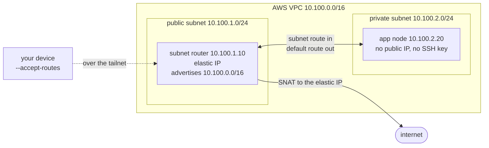

# Tailscale subnet router on AWS, with Terraform

[](https://github.com/nopoz/tailscale-subnet-router-aws/actions/workflows/ci.yml)
[](LICENSE)
[](versions.tf)

Deploys a Tailscale subnet router and a private, SSH-enabled node into a new AWS
VPC. The private node has no public IP address, no SSH key, and no inbound
security group rule. The only way to reach it is over the tailnet.

Route approval is code too. `autoApprovers` in the tailnet policy approves the VPC
CIDR for anything carrying the router's tag, so the route is live the moment the
router registers and nobody clicks anything.

- [Architecture](#architecture)
- [What it builds](#what-it-builds)
- [Before you run this](#before-you-run-this)
- [Deploy](#deploy)
- [Verify by hand](#verify-by-hand)
- [Tear down](#tear-down)
- [Design notes](#design-notes)
- [Troubleshooting](#troubleshooting)

## Architecture



The private subnet's route table has no entry for the internet gateway at all. Its
only default route points at the subnet router's network interface, so that one
corridor in the middle carries everything: your traffic in, because `autoApprovers`
approved the advertised route at registration, and the app node's traffic out,
because it has nowhere else to go. Packets leaving that way arrive wearing the
router's elastic IP, which is what `curl ifconfig.me` proves on a host with no
public address of its own.

## What it builds

- an AWS VPC with one public and one private subnet
- a subnet router EC2 instance in the public subnet advertising the whole VPC
  CIDR, which also acts as the NAT instance for the private subnet
- an app node in the private subnet with no public IP and Tailscale SSH enabled
- two ephemeral, single-use, tagged auth keys, created and destroyed with the stack

It does **not** touch your tailnet policy file. That stays yours; see the design
notes for why.

## Before you run this

Requirements:

- Terraform 1.6.6 or newer. Earlier 1.6 patches ship a release signing key that
  has since expired and cannot install providers at all, failing on
  `openpgp: key expired`
- AWS credentials that can create a VPC and EC2 instances (`AmazonEC2FullAccess`
  is sufficient and appropriately scoped)
- Python 3 for `verify.py`, standard library only
- A POSIX shell; on Windows, use WSL
- Tailscale on your own machine, joined to the same tailnet, to reach the nodes by
  hand. `terraform` and `verify.py` do not need it; both work over the API alone

### 1. Merge the policy additions

Copy the blocks in [docs/policy-additions.hujson](docs/policy-additions.hujson)
into your tailnet policy file, merging into any keys you already have; HuJSON
rejects duplicates.

Do this before step 2: its tag picker only lists tags already in your policy, and
`autoApprovers` is evaluated at registration, so it must exist before anything boots.

### 2. Create the credentials

**A trust credential** for Terraform, under Settings, Trust credentials. Expand
**Keys** and tick **Write** on **Auth Keys**; Read comes with it. Write requires
tags, so select `tag:aws-subnet-router` and `tag:aws-app`. Leave every other row
unticked.

**An API access token** for `verify.py`, under Settings, Keys.

### 3. Configure

```bash
cp .env.example .env
# fill in the five values in .env
source .env
```

`.env` is gitignored. Terraform reads no env file of its own, so sourcing is what
turns those lines into the `TF_VAR_*` variables it looks for; do it once per shell.

Nothing is pinned to a region. The AMI is resolved from Canonical's owner ID and a
name pattern, and the availability zone comes from a data source, so both follow
whichever region you set.

Two caveats. Both subnets land in the region's **first** availability zone, and
instance type availability is decided per-AZ rather than per-region, so if AWS
rejects `t3.micro` you need a type that exists in that specific AZ; there is no
variable for choosing a different one.

And the **VPC CIDR is not freely changeable**, despite being a variable. Your
policy file names `10.100.0.0/16` in both `autoApprovers` and the grants you merged
in, so changing `TF_VAR_vpc_cidr` on its own leaves the advertised route unapproved,
and `verify.py` spends its full five minute deadline before saying so. To move the
VPC, update your policy file to match, along with the two subnet CIDRs and the two
fixed private IPs.

## Deploy

```bash
terraform init
terraform apply
./verify.py "$(terraform output -raw advertised_route)"
```

`advertised_route` is the CIDR the subnet router advertises, so `verify.py` always
checks the network you actually deployed rather than one written down in a README.

`terraform apply` returns as soon as AWS hands back the instances, which is well
before either node has booted, installed Tailscale, and registered. `verify.py`
is what closes that gap: it polls the Tailscale API until the router is advertising
**and** its route is approved, and the app node is up with SSH enabled. It exits
non-zero if that has not happened within five minutes.

It reports each node separately and announces the moment a check starts passing:

```
waiting up to 5 minutes for 2 checks against 10.100.0.0/16
  [  0s] app node: expected exactly 1 device tagged tag:aws-app, found 0
  [  0s] subnet router: expected exactly 1 device tagged tag:aws-subnet-router, found 0
  [ 31s] subnet router: OK, advertising and routing 10.100.0.0/16
  [ 42s] app node: OK, registered with Tailscale SSH enabled
converged in 42s
```

Timestamps advance in ten second steps because that is the poll interval, so a check
that clears between two polls is reported at the next one.

The router clears first; the app node cannot install Tailscale until the router's
NAT is up, so its wait is the longer one.

For repeat cycles, the whole deploy-and-prove step is one line:

```bash
terraform apply -auto-approve && ./verify.py "$(terraform output -raw advertised_route)"
```

Expect roughly 45 seconds for the apply and another 45 for both nodes to boot,
install Tailscale, and register.

The checks `verify.py` makes have unit tests, which need no credentials, no tailnet
and no deployed stack:

```bash
python3 -m unittest discover -s tests
```

A green `verify.py` means the tailnet **converged**. It does not mean you can reach
anything. Every check it runs reads the control plane over the API: the route shows
as approved, the app node reports SSH enabled. Whether a packet actually crosses the
subnet route, and whether SSH lets you in, is unproven until you try it. Do the next
section at least once per deployment.

## Verify by hand

```bash
host=$(terraform output -raw app_hostname)
app=$(tailscale status | awk -v h="$host" '$2 == h {print $1}')

tailscale status            # both nodes present, tagged, no ghosts from a previous run
tailscale ping 10.100.2.20  # pong from the subnet router: the route carries traffic
tailscale ping "$app"       # pong from the app node, via 10.100.2.20 over that route
ssh ubuntu@"$app"           # no key, no bastion, no inbound rule
curl -s ifconfig.me         # run inside that session: the router's elastic IP
```

Each line proves something the previous one did not. Pinging `10.100.2.20` exercises
the subnet route, and the pong comes back from `tailscale-aws-subnet-router` rather
than from the app node, because the router is the node answering for that address;
that is what a working route looks like. Pinging the app node's own tailnet address
reaches the node itself, and the `via` clause reads `10.100.2.20:41641`: the app
node's private address, which your client can reach as an endpoint only because it
accepted the advertised route. Expect `DERP(region)` there instead for the first
reply or two, while the direct path is still being negotiated. The `ssh` is
Tailscale SSH admitting you with no key material anywhere in this repository. And
`curl`, run inside that session, is the thing worth proving: a host with no public
address, reaching the internet, wearing the router's IP.

The `awk` matches the hostname column exactly rather than searching the line,
because Tailscale resolves a hostname collision by appending `-1`. A ghost from a
previous run keeps the plain name and pushes the live node to `-app-1`, and a
search would return both addresses in one variable.

If your tailnet has MagicDNS enabled you can use `ssh ubuntu@"$host"` instead of
the address. With MagicDNS off, the name in `tailscale status` comes from the peer
list rather than DNS and will not resolve.

## Tear down

```bash
terraform destroy
terraform state list                 # expect empty output
```

Both nodes register as ephemeral devices, so Tailscale removes them from the
tailnet shortly after they go offline. Expect a few minutes of lag rather than
instant disappearance; they will show as offline immediately.

Your tailnet policy is untouched, on destroy and at every other point, because this
configuration never manages it. The blocks you merged in during setup stay until you
remove them; they are inert once the tagged devices are gone.

Tear down when you are not using the stack. A public IPv4 address bills whether it
is attached to anything or not, so a leftover elastic IP is the one thing here that
costs money while doing nothing.

## Design notes

**No SSH keys anywhere.** There is no `aws_key_pair` resource, `key_name` is never
set, and neither security group has an inbound rule for TCP 22. Access is Tailscale
SSH only, governed by the `ssh` block in the policy file.

**No NAT gateway.** The subnet router already forwards packets, so it doubles as
the NAT instance for the private subnet. That saves roughly $32 a month and makes
the subnet router structurally necessary rather than decorative.

**The masquerade rule excludes VPC-internal traffic.** It matches
`-s 10.100.2.0/24 ! -d 10.100.0.0/16`, so only packets actually leaving the VPC get
their source rewritten; anything the app node sends to another VPC address still
arrives wearing `10.100.2.20`, where a security group can reason about it. Traffic
arriving *from* the tailnet never reaches this rule in either direction, because
Tailscale has already rewritten it to the router's own address and it no longer
matches `-s 10.100.2.0/24`. That rewrite, not this rule, is why the app node's
security group can name the subnet router as its only source.

**Routes are approved by policy, not by hand.** `autoApprovers` approves the VPC
CIDR for anything tagged `tag:aws-subnet-router`, so the route is live the moment
the router registers. Forgetting to approve a route is the most common failure in
a manual subnet router deployment; this removes the step rather than documenting
it. Terraform cannot order against a policy it does not own, so merging the blocks
is a prerequisite rather than a dependency, and `verify.py` is what catches you
having skipped it.

**The tags own themselves.** `tagOwners` entries list each tag as its own owner
alongside `autogroup:admin`. A principal can only apply a tag it owns, and an
OAuth client is not a human, so it is in no autogroup. With `autogroup:admin` as
the only owner, every human admin can apply the tag and the automation cannot,
which surfaces as `requested tags are invalid or not permitted` even though the
client visibly carries the tag.

**Both nodes decline tailnet DNS.** `--accept-dns=false`. A tailnet with a global
nameserver pushes it to every node, and a resolver living on someone's home LAN is
unreachable from a VPC. The node ends up with working egress and no name
resolution, which presents as "the internet is down" while `tailscale status`
looks perfectly healthy, because `tailscaled` reaches DERP on hardcoded addresses
and never needs DNS. Declining keeps the VPC resolver the instances were born with.

**The tailnet policy file is not managed here, on purpose.** `tailscale_acl` is a
whole-file resource, and so is the API beneath it: `GET` and `POST`, no `PATCH`. Any
configuration that owned the policy would have to ship a complete one, which means
shipping its author's rules and replacing whatever the operator already had. There
is no way to add four blocks and remove them again on destroy.

The API does offer a guard, `If-Match: ts-default`, which performs the write only if
the policy is still the untouched default Tailscale creates for a new tailnet. The
provider exposes no way to send it, and its own `Overwrite Protected` error is
bypassed rather than satisfied by importing. So rather than disable a protection to
buy convenience, the boundary moved: this configuration owns the auth keys, which it
creates and destroys cleanly, and you own your policy file.

The cost is one manual merge during setup. The benefit is that running this cannot
damage your access control, and no rules from anyone else's tailnet ship with it.

**`verify.py` only counts devices connected to the control plane.** Ephemeral
devices are not removed the instant their instance terminates, so for a few minutes
after a destroy the tailnet still lists the dead node along with the routes it used
to advertise. Counting those is wrong in both directions: a ghost on its own reports
success against infrastructure that no longer exists, and a ghost beside its
replacement reports two routers for a tailnet that is healthy. Filtering on
`connectedToControl` removes both failure modes.

**The AMI is pinned to a specific Canonical build.** `var.ami_name_filter` names one
image rather than globbing for the newest, so rebuilding does not silently pick up
whatever Canonical published overnight. It is pinned by *name* rather than by AMI ID,
because IDs differ per region and pinning one would undo the region portability
described above. Point it at
`ubuntu/images/hvm-ssd*/ubuntu-noble-24.04-amd64-server-*` to track the latest instead,
which is the right choice for anything long-lived.

**Auth keys travel in user data.** That is readable by anyone who can call
`DescribeInstanceAttribute`. The mitigation is that the keys are single-use,
pre-authorized, and expire in an hour, so they are worthless shortly after boot.
SSM Parameter Store behind an instance profile would be stricter, at the cost of
four more resources.

**The VPC is `10.100.0.0/16` on purpose.** Home networks commonly sit on
`10.0.0.0/24` or `192.168.0.0/24`. Overlapping subnets are the one subnet router
problem with no clean fix short of readdressing or `4via6`, so it is worth avoiding
by choosing an unusual range.

## Troubleshooting

**Peers are advertising routes but `--accept-routes` is false.** Run
`tailscale set --accept-routes` on the client. Linux and Windows do not accept
advertised routes by default. Tailscale's health check reports this, and it is the
single most common reason a correctly configured subnet router appears not to work.

**`ssh ubuntu@10.100.2.20` returns `Permission denied (publickey)`.** Expected.
Tailscale SSH only intercepts connections arriving on the tailnet interface. Reaching
the node through the subnet route delivers to `ens5`, where stock `sshd` answers and
wants a key that does not exist. Use the node's tailnet address for SSH; the private
address is for everything else.

**Accepted routes are missing from `ip route`.** Tailscale installs them in policy
routing table 52. Use `ip route show table 52`.

**A cloud-init edit changed nothing.** `user_data` is an in-place update: Terraform
sends the new text and a running instance never reads it again. `-replace` does not
help either, because the auth keys are single-use and the replacement would be handed
a spent one. Run `terraform destroy` and then `terraform apply`.

**`keys: description had invalid characters`.** `.` `,` `/` and `:` are rejected in
an auth key description; letters, digits, spaces, hyphens and underscores are fine.
The description is built from `var.project`, so punctuation in a project name fails
at apply time rather than at plan time.

**`requested tags are invalid or not permitted` when creating auth keys.** The tags
must list themselves as owners in your `tagOwners`, not just `autogroup:admin`. A
principal can only apply a tag it owns, and the OAuth client is not a human, so it
belongs to no autogroup. Copy the `tagOwners` block from
[docs/policy-additions.hujson](docs/policy-additions.hujson) exactly.

**`403` creating auth keys.** Check the credential's granted scopes: `auth_keys`
is read and write, `auth_keys:read` is not, and Read alone is what you get if Write
never took.

**`verify.py` reports the route advertised but not approved.** The `autoApprovers`
block is missing from your policy file, or its CIDR does not match `var.vpc_cidr`.
